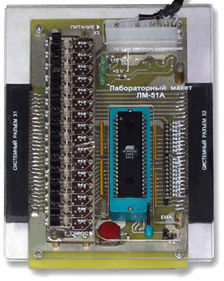

## Laboratory work 2 "Development of real-time algorithms"

## Task

The assignment involves writing and debugging a a program that implements the selected type of animation. The primary
code of the program should consist of three parts: the main part, the initialization procedure and an interrupt handling
routine.
When evaluating the program, the following qualities will be taken into account

- solving an algorithmic problem (whether the program implements the selected animation)
- compliance with the selected interrupt period at a clock frequency of 12 MHz and
  the frame change period specified in the task;
- availability, sufficiency and content of comments in the program's source code.

Based on the system analysis of the animation process and taking into account the architectural features of the AT89C51
microcontroller, develop a program algorithm that would provide displaying the selected animation option on the LED
displays of the laboratory layout LM51A. Animation option - 16, "Worm". The frame change period is 0.36 seconds.

# Лабораторна робота 2 "Розробка алгоритмів реального часу"

## Завдання

Завдання передбачає написання та відлагодження
програми, яка реалізує вибраний вид анімації. Первинний код програми повинен
складатися із трьох частин: головної частини, процедури ініціалізації та
підпрограми обробки переривань.
При оцінюванні програми будуть враховуватися її наступні якості:

- вирішення алгоритмічної задачі (чи реалізує програма обрану анімацію);
- дотримання обраного періоду переривань при тактовій частоті 12 МГц та
  вказаного в завданні періоду зміни кадрів;
- наявність, достатність та зміст коментарів у первинному коді програми.

На основі системного аналізу анімаційного процесу та з урахуванням архітектурних
особливостей мікроконтролера АТ89С51 розробити алгоритм програми, яка б забезпечувала
відображення обраного варіанту анімації на світлодіодних дисплеях лабораторного макету
ЛМ51А. Варіант анімації – 16, «Черв’ячок». Період зміни кадрів – 0.36 с.

